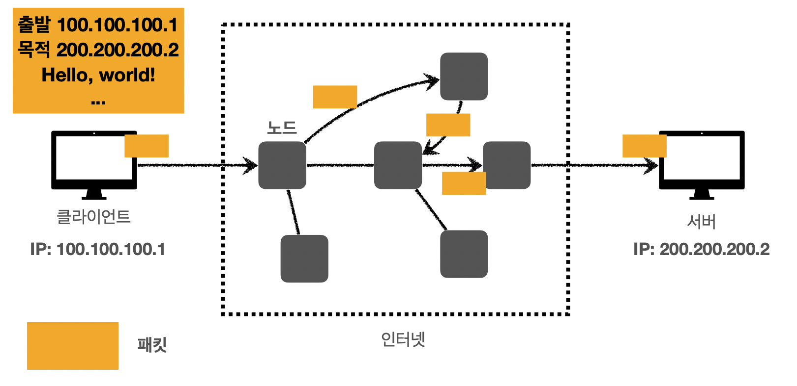

# 인터넷 네트워크

## 목차

1. IP (Internet Protocol)
2. TCP, UDP
3. PORT
4. DNS

------

## 1. IP (Internet Protocol)

**인터넷 프로토콜 역할:**

- 지정한 IP 주소(IP Address) 에 데이터 전달
- ***패킷(Packet)**이라는 통신 단위로 데이터 전달

> **IP 패킷 정보:** 출발지와 목적지 IP를 포함한 정보가 포함되어 있다.
>
> 

**패킷이 전달되는 과정:**

1. 인터넷에 많은 노드들이 존재한다.

2. 노드에 패킷을 전달한다.

3. 노드끼리 패킷을 전달하면서 최종적으로 목적지 IP로 전달한다.

   

   **IP 프로토콜의 한계:**

   - 비연결성

     - 패킷을 받을 대상이 없거나 서비스 불능 상태임에도 패킷이 전송된다.

       

   - 비신뢰성

     - 중간에 패킷이 사라질 수 있다.

     - 패킷의 순서를 보장하지 않는다.

       

   - 프로그램 구분

     - 같은 IP를 사용하는 서버에서 통신하는 애플리케이션이 여러 개일 수 있다. ex) 하나의 PC에서 여러개의 게임을 동시에 한다.

   위와 같은 IP 프로토콜의 한계를 TCP/UDP가 보완해준다.

## 2. TCP, UDP

**인터넷 프로토콜 스택 계층:**

> 메세지는 각 계층을 지나면서 각 Layer에 해당하는 정보를 추가하게 된다.

**TCP/IP 패킷 정보:**

- IP 패킷: 출발지 IP, 목적지 IP 등
- TCP 세그먼트: 출발지 PORT, 목적지 PORT, 전송 제어, 순서, 검증 정보 등

**TCP(Transmission Control Protocol) 특징:**

- 연결지향 - TCP 3 Way handshcake (가상 연결)
- 데이터 전달 보증
- 순서 보장

TCP는 신뢰할 수 있는 프로토콜로, 현재 대부분이 사용한다. (TCP 세그먼트에 전송 제어, 순서, 검증과 관련된 정보가 포함되어 있다.)

**TCP 3 Way handshake:**

> TCP는 3 Way handshake를 통해 각 노드가 정상적으로 응답을 할 수 있는지를 확인한다. *양단의 각 노드끼리의 연결이 논리적으로 맺어지고, 중간의 거쳐가는 노드들의 연결상태는 알 수 없다.

**데이터 전달 보증:**

노드에서 다른 노드로 데이터를 전달 했을 때, 정상적으로 받았다는 신호를 받게 된다. 응답이 오지 않을 경우 문제가 있다고 판단하게 된다.

**순서 보장:**

**UDP(User Datagram  Protocol)의 특징:**

- 데이터 전달 및 순서가 보장되지 않지만 빠르다.
- 연결지향적이지 않다.

UDP는 IP의 거의 비슷한 프로토콜이다. IP에서 PORT와 체크섬 정도가 추가되어 있는 정도이기 때문에 application level에서 추가적인 작업이 필요하다.

## 3. PORT

IP 주소만 이용해서 통신할 경우 다음과 같은 상황에서 문제가 생길 수 있다.

> 게임과 화상통화를 통시에 이용할 경우, 각 application의 패킷을 구별할 수 없게 된다.

따라서 PORT를 이용해서 같은 IP에서 각 프로세스를 구분하게 된다.

> PORT는 0 ~ 65535까지 존재하는데 0 ~ 1023은 잘 알려진 PORT로, 사용하지 않는 것이 좋다. 
> FTP: 20, 21 
> SFTP: 22 
> TELNET: 23 
> HTTP: 80 
> HTTPS: 443

## 4. DNS

IP 주소를 이용한 통신의 단점:

- 기억하기 어렵다.
- IP 주소가 변경될 수 있다.

위와 같은 단점을 해소하기 위해 DNS(Domain Name System)을 사용한다.

DNS는 도메인 명을 지정하고 IP주소로 변경할 수 있게 해준다.

