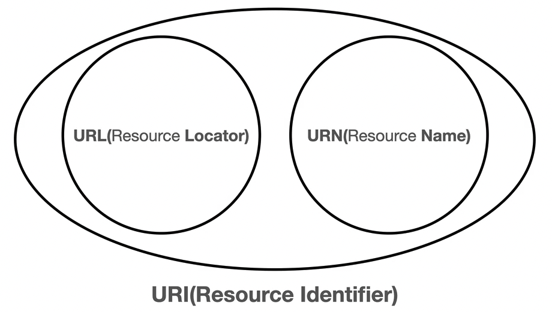
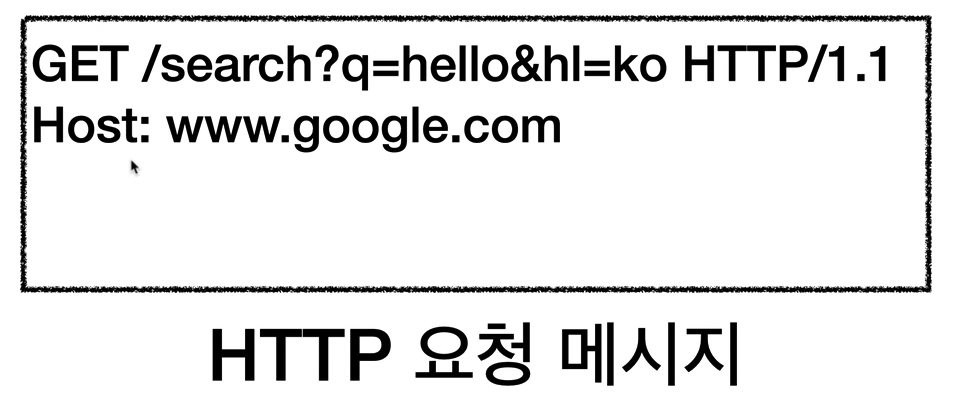
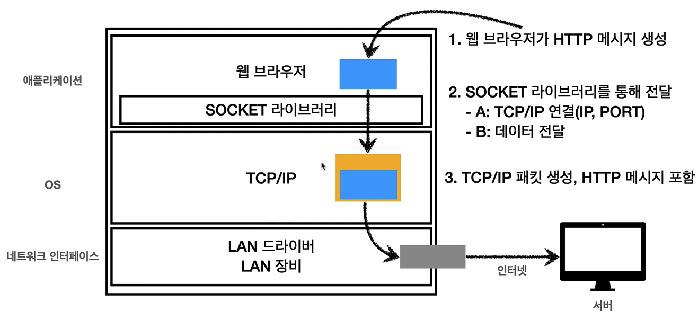
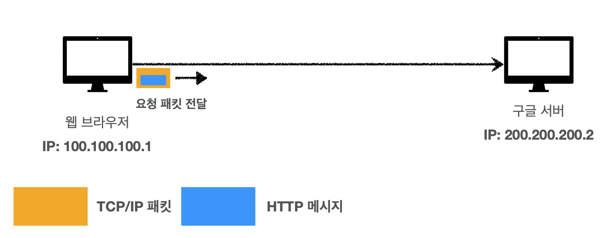
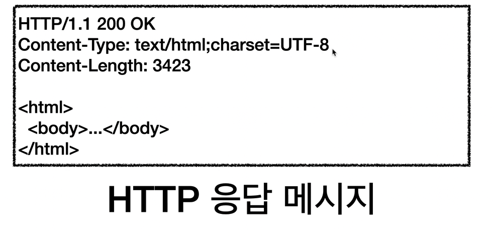
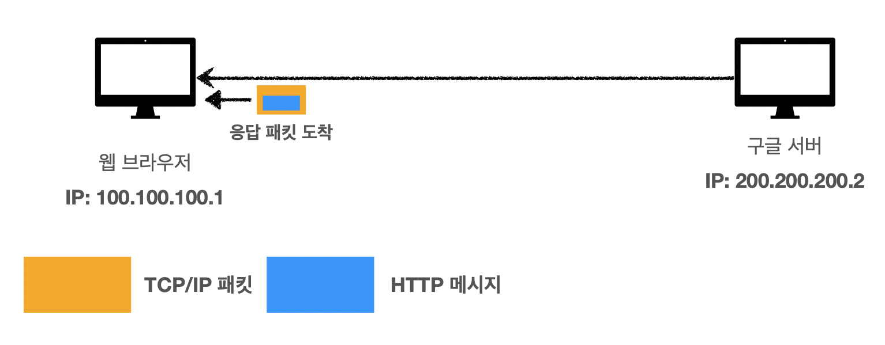

# URI와 웹 브라우저 요청 흐름

## 목차

1. URI
2. 웹 브라우저 요청 흐름

------


## 1. URI

URI는 Uniform Resource Identifier이다. 즉, 리소스를 식별해주는 구별자가 된다.

> Uniform: 리소스를 식별하는 통일된 방식 Resource: 지원, URI로 식별할 수 있는 모든 것 Identifier: 다른 항목과 구분하는데 필요한 정보



**URL, URN:**

- URL - Locator: 리소스가 있는 위치를 지정
- URN - Name: 리소스에 이름을 부여
  - URN 이름만으로 실제 리소스를 찾는 방법이 보편화되지 않음
  - 위치는 변할 수 있지만, 이름은 변하지 않는다.

**URL의 문법:**

schema://[userinfo@]host[:port]'[/path]'[?query]'[#fragment]'

https://www.google.com:443/search?q=hello&hl=ko

- schema:
  - 주로 프로토콜 사용
- [userinfo@]:
  - URL에 사용자 정보를 포함해서 인증
  - 거의 사용하지 않는다.
- host:
  - 호스트명
  - 도메인명 또는 IP 주소를 직접 사용할 수 있다.
- [:port]:
  - 접속 포트
  - 일반적으로 생략한다. (http는 80, https는 443)
- [/path]:
  - 리소스 경로
  - 계층적 구조
- [?query]:
  - key=value 형태
  - ?로 시작, &로 추가할 수 있다.
  - query parameter, query string 등으로 불린다.
- [#fragment]:
  - 거의 사용하지 않는다.
  - html 내부 북마크 등에 사용
  - 서버에 전송하지 않음


## 2. 웹 브라우저 요청 흐름

먼저 다음과 같은 요청이 있다고 해보자.

```html
<https://www.google.com/search?q=hello&hl=ko>
```

위 요청의 DNS를 조회한 후, HTTP 요청 메세지를 생성하게 된다.

대략적으로 HTTP 요청 메세지는 다음과 같다.





그리고 위 과정을 거쳐서 최종적으로 TCP/IP 패킷이 생성된다.



생성된 요청 패킷을 서버에 전달하게 되면 HTTP 응답 메세지가 생성된다.



응답 메세지는 content-type과 http 버전 등을 포함한 정보를 가진다.



응답 패킷이 도착하면 메세지의 html 을 렌더링하여 사용자에게 보여준다.