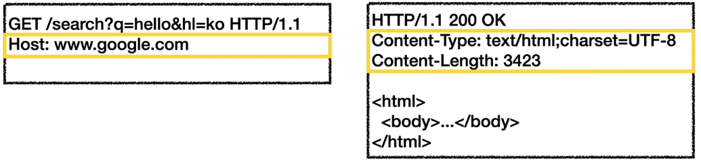

# HTTP 기본

## 목차

1. 모든 것이 HTTP
2. 클라이언트 - 서버 구조
3. Stateful, Stateless
4. 비연결성
5. HTTP 메세지

------

## 1. 모든 것이 HTTP

**HTTP 메세지에 전송하는 것:**

- HTML, TEXT
- IMAGE, 음성, 영상, 파일
- JSON, XML (API)
- 이외의 거의 모든 형태의 데이터

**HTTP의 역사:**

- HTTP/0.9 1991년: GET 메서드만 지원, HTTP 헤더 X
- HTTP/1.0 1996년: 메서드, 헤더 추가
- HTTP/1.1 1997년: 가장 많이 사용
  - RFC2068 (1997) → RFC2616 (1999) → RFC7230 ~ 7235 (2014)
- HTTP/2 2015년: 성능 개선
- HTTP/3 현재: TCP 대신에 UDP 사용, 성능 개선

**HTTP의 특징:**

- 클라이언트 서버 구조
- 무상태 프로토콜(stateless), 비연결성
- HTTP 메세지
- 단순함, 확장 가능

## 2. 클라이언트 - 서버 구조

- Request - Response 구조

- 클라이언트: 서버에 요청을 보내고, 응답을 대기

- 서버: 요청을 대기하다가, 요청시 결과를 만들어서 응답

  

> **클라이언트 - 서버 구조의 장점:** 비즈니스 로직과 데이터는 서버에, 사용성과 UI는 클라이언트에서 집중함으로써 각각이 독립적으로 발전할 수 있게 되었다.

## 3. Stateful, Stateless

**Stateless:**

- 서버가 클라이언트의 상태를 보존하지 않는다.
- 장점: 서버 확장성이 높다. (스케일 아웃)
- 단점: 클라이언트가 추가 데이터 전송

**Stateful과 Stateless의 차이:**

1. stateful:

   > 고객: 이 **노트북** 얼마인가요? 점원: 100만원입니다. **(노트북 상태 유지)**

   고객: **2개** 구매하겠습니다. 점원: 200만원입니다. **결제방법**은 어떤 걸로 하시겠어요? **(노트북, 2개 상태 유지)**

   고객: **신용카드**로 구매하겠습니다. 점원: 200만원 결제 완료되었습니다. **(노트북, 2개, 신용카드 상태 유지)**

   > 

2. stateless:

   > 고객: 이 **노트북** 얼마인가요? 점원: 100만원입니다.

   고객: **노트북 2개** 구매하겠습니다. 점원: 노트북 2개는 200만원입니다. **결제방법**은 어떤 걸로 하시겠어요?

   고객: **노트북 2개를 신용카드**로 구매하겠습니다. 점원: 200만원 결제 완료되었습니다.

   > 

**차이점 정리:**

> stateful: 중간에 다른 점원으로 바뀌면 안된다. (다른 점원으로 바뀔 때 상태 정보를 다른 점원에게 미리 알려줘야 한다.)

stateless: 중간에 다른 점원으로 바뀌어도 된다. → 갑자기 고객이 증가해도 점원을 대거 투입할 수 있다. (갑자기 클라이언트 요청이 증가해도 서버를 대거 투입할 수 있다.)

stateless는 응답 서버를 쉽게 바꿀 수 있다. → **무한 서버 증설 가능 → 응답하던 서버가 장애나도, 다른 서버에서 대응할 수 있다.**

> 

**stateless의 실무적 한계:**

- 모든 것을 무상태로 설계할 수 없는 경우도 있다.
- 무상태
  - 로그인이 필요 없는 단순한 서비스 소개 화면
- 상태 유지
  - 로그인한 사용자의 경우 로그인 했다는 상태를 서버에 유지
  - 일반적으로 브라우저 쿠키와 서버 세션등을 사용해서 상태 유지
  - 상태 유지는 최소한만 사용

## 4. 비연결성

- HTTP는 기본적으로 연결을 유지하지 않는 모델
- 일반적으로 초 단위 이하의 빠른 속도로 응답
- 1시간 동안 수천명이 서비스를 사용해도 실제 서버에서 동시에 처리하는 요청은 수십개 이하로 매우 적음
  - 웹 브라우저에서 계속 연속해서 검색 버튼을 누르지는 않는다.
- 서버의 자원을 매우 효율적으로 사용할 수 있음

**한계와 극복:**

- TCP/IP 연결을 새로 맺어야 한다.
  - 3 Way handshake 시간 추가
- 웹 브라우저로 사이트를 요청하면 HTML 뿐만 아니라 JS, CSS, 추가 이미지 등 수 많은 자원이 함께 다운로드
- 현재는 HTTP 지속 연결 (Persistent Connections)로 문제 해결
- HTTP/2, HTTP/3에서 더 많은 최적화

**HTTP 초기와 현재:**

초기: 연결, 종료 낭비

현재:

## 5. HTTP 메세지

**요청 메세지 구조:**

- start-line

  - **request-line** / status-line

    

- request-line

  - method SP(공백) request-target SP HTTP-version CRLF(엔터)
  - method: GET, request-target: /search?q=hello&hl=k0, HTTP-version: HTTP/1.1

- method

  - 종류: GET, POST, PUT, PATCH, DELETE...
  - 서버가 수행해야 할 동작 지정: GET - 리소스 조회, POST: 요청 내역 처리

- request-target

  - absolute-path[?query]
  - 절대경로: ‘/’로 시작하는 경로
  - 참고: *, http://...?x=y 와 같은 다른 유형의 경로 지정 방법도 있다.

- HTTP-version

  - HTTP/1.1, HTTP/2 등

**응답 메세지 구조:**

- start-line

  - request-line / **status-line**

    

- status-line

  - HTTP-version SP status-code SP reason-phrase CRLF

- status-code

  - 200 - 성공, 400 - 클라이언트 요청 오류, 500 - 서버 내부 오류

- reason-phrase

  - 사람이 이해할 수 있는 짧은 상태 코드 설명 글

**HTTP 헤더:**

- header-field

  

  - field-name “:” OWS field-value OWS (OWS: 띄어쓰기 허용)
  - field-name은 대소문자 구분 없음

- HTTP 전송에 필요한 모든 부가 정보

  - 메세지 바디의 내용, 메세지 바디의 크기, 압축, 인증, 요청 클라이언트(브라우저) 정보, 서버 애플리케이션 정보, 캐시 관리 정보 ...

- 임의의 field 도 추가할 수 있음

**HTTP 바디:**

- 실제 전송할 데이터
- HTML 문서, 이미지, 영상, JSON 등등 byte로 표현할 수 있는 모든 데이터 전송 가능