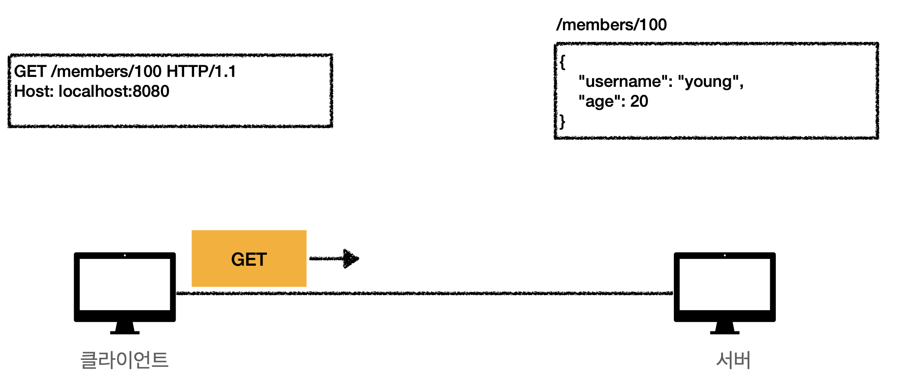
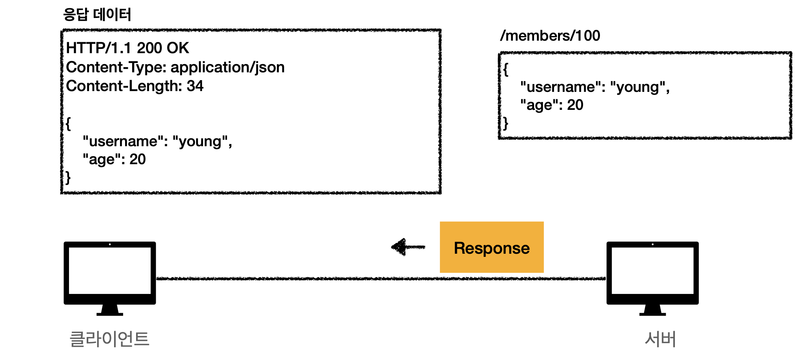
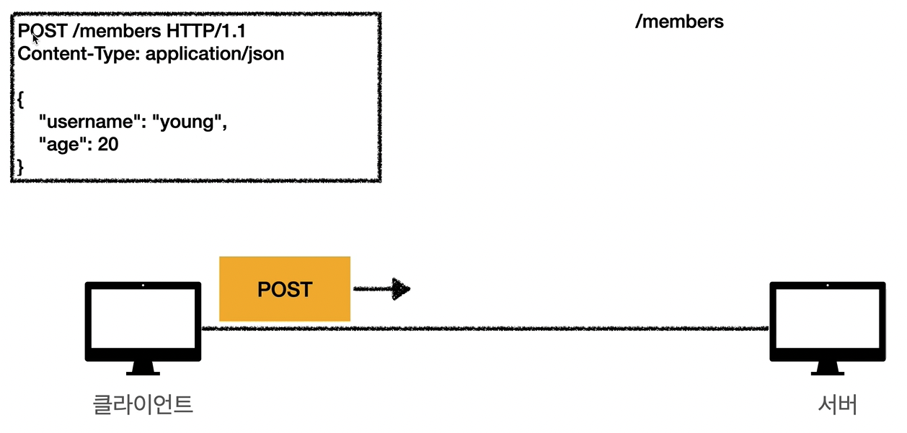
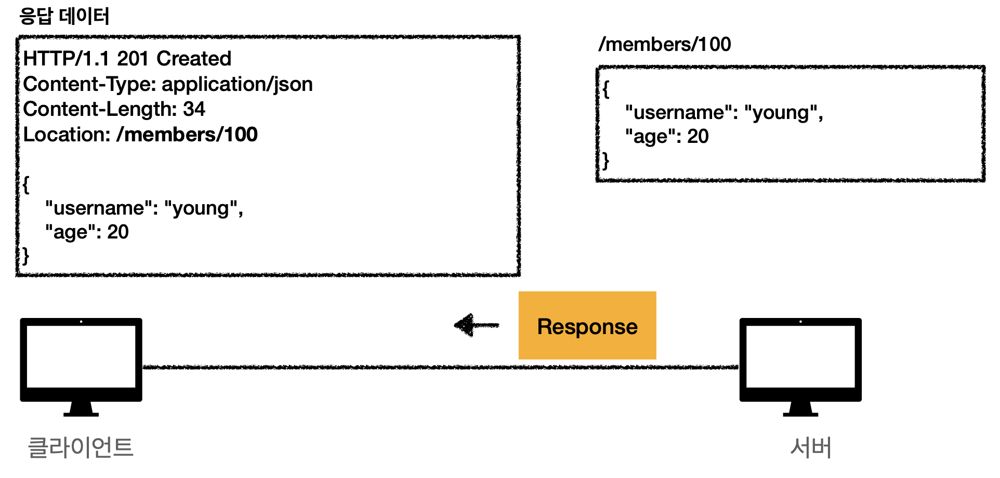
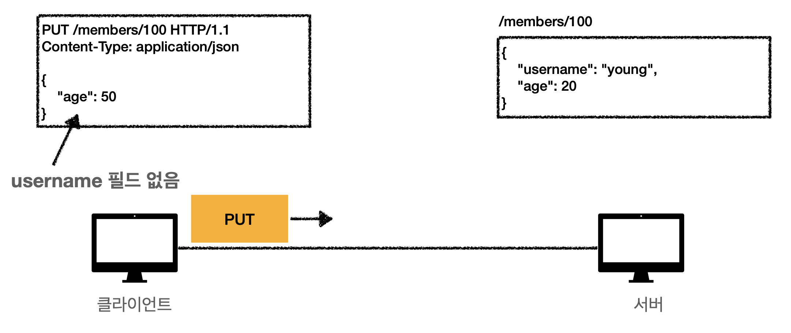
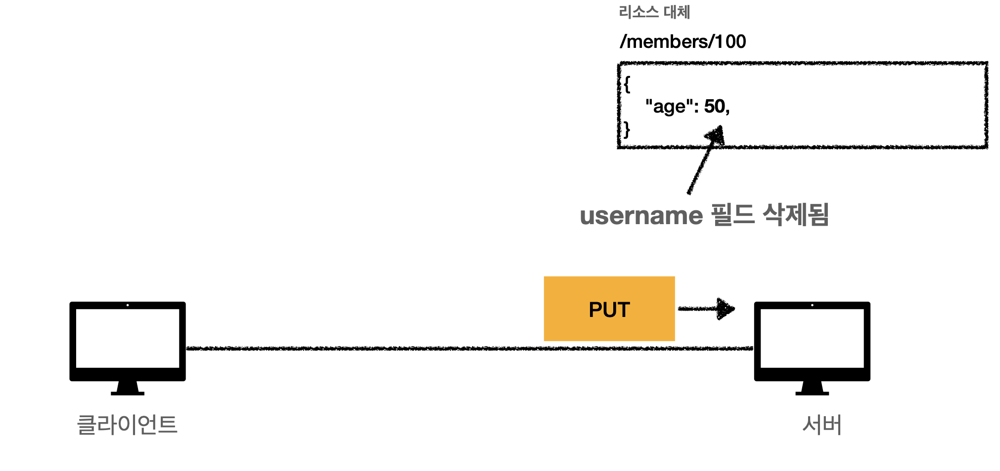
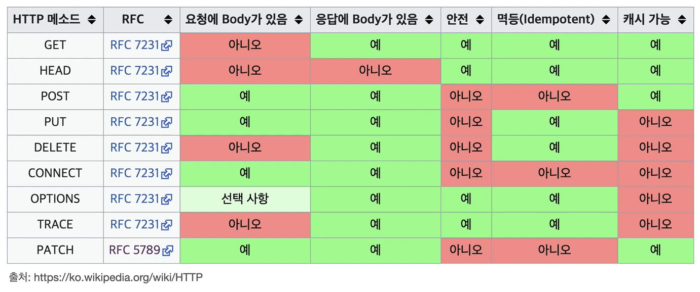

# HTTP 메서드

## 목차

1. HTTP API를 만들어보자
2. HTTP 메서드 - GET, POST
3. HTTP 메서드 - PUT, PATCH, DELETE
4. HTTP 메서드의 속성

------

## 1. HTTP API를 만들어보자

*가장 중요한 것은 리소스 식별

- 리소스의 의미는 뭘까?
  - 회원을 등록하고 수정하고 조회하는 것이 리소스가 아니다.
  - 회원이라는 개념 자체가 바로 리소스다.
- 리소스를 어떻게 식별하는게 좋을까?
  - 회원을 등록하고 수정하고 조회하는 것을 모두 배제
  - 회원이라는 리소스만 식별하면 된다. → 회원 리소스를 URI에 매핑

**API URI 설계:**

- **회원** 목록 조회 /members
- **회원** 조회 /members/{id}
- **회원** 등록 /members/{id}
- **회원** 수정 /members/{id}
- **회원** 삭제 /members/{id}

→ 어떻게 구분하지?

URI는 리소스만 식별 → 리소스: 명사, 행위: 등록, 조회, 수정, 삭제

→ 행위는 HTTP method를 이용한다.

## 2. HTTP 메서드 - GET, POST

**주요 메서드:**

- GET: 리소스 조회
- POST: 요청 데이터 처리, 주로 등록에 사용
- PUT: 리소스를 대체, 해당 리소스가 없으면 생성
- PATCH: 리소스 부분 변경
- DELETE: 리소스 삭제

**기타 메서드:**

- HEAD: GET과 동일하지만 메세지 부분을 제외하고, 상태 줄과 헤더만 반환
- OPTIONS: 대상 리소스에 대한 통신 가능 옵션을 설명 (주로 CORS에서 사용)
- CONNECT: 대상 자원으로 식별되는 서버에 대한 터널을 설정
- TRACE: 대상 리소스에 대한 경로를 따라 메세지 루프백 테스트를 수행

**GET:**

- 리소스 조회
- 서버에 전달하고 싶은 데이터는 query를 통해서 전달
- 메세지 바디를 사용해서 데이터를 전달할 수 있지만, 지원하지 않는 곳이 많아서 권장하지 않음

**POST:**

- 요청 데이터 처리
- 메세지 바디를 통해 서버로 요청 데이터 전달
- 서버는 요청 데이터를 처리
  - 메세지 바디를 통해 들어온 데이터를 처리하는 모든 기능을 수행한다.
- 주로 전달된 데이터로 신규 리소스 등록, 프로세스 처리에 사용

**요청된 데이터를 어떻게 처리한다는 것일까?**

- 스펙: POST 메서드는 대상 리소스가 리소스의 고유한 의미 체계에 따라 요청에 포함된 표현을 처리하도록 요청한다.
- 예를 들어 다음과 같은 기능에 사용된다.
  - HTML 양식에 입력된 필드와 같은 데이터 블록을 데이터 처리 프로세스에 제공
    - HTML FORM에 입력한 정보로 회원가입, 주문 등
  - 게시판, 뉴스 그룹, 메일링 리스트, 블로그 또는 유사한 기사 그룹에 메세지 게시
    - 게시판 글쓰기, 댓글 달기
  - 서버가 아직 식별하지 않은 새 리소스 생성
    - 신규 주문 생성
  - 기존 자원에 데이터 추가
    - 한 문서 끝에 내용 추가하기
- **즉, 이 리소스 URI에 POST 요청이 오면 요청 데이터를 어떻게 처리할지 리소스마다 따로 정해야 함 → 정해진 것이 없음**

## 3. HTTP 메서드 - PUT, PATCH, DELETE

**PUT:**

- 리소스를 완전히 대체

  - 리소스가 있으면 대체
  - 리소스가 없으면 생성

- *

  클라이언트가 리소스를 식별

  - 클라이언트가 리소스 위치를 알고 URI 지정
  - POST와 차이점

- **주의! 리소스를 완전히 대체한다!**

**PATCH:**

- 리소스 부분 변경

**DELETE:**

- 리소스 제거

## 4. HTTP 메서드의 속성

- 안전 (Safe Methods)
- 멱등 (Idempotent Methods)
- 캐시 가능 (Cacheable Methods)

**안전 (Safe Methods):**

- 호출해도 리소스를 변경하지 않는다.
- 계속 호출해서 로그 같은 것이 쌓여 장애가 발생하는 경우
  - 그런 경우는 고려하지 않는다.

**멱등 (Idempotent Methods):**

- f(f(x)) = f(x)

- 한 번 호출하던 두 번 호출하던 100번 호출하던 결과가 똑같다.

- **멱등은 외부 요인으로 중간에 리소스가 변경되는 것은 고려하지 않는다.**

- 멱등 메서드:

  - **GET**: 몇번 조회하던 같은 결과가 조회된다.

  - **PUT**: 결과를 대체한다. 따라서 같은 요청을 여러번 해도 최종 결과는 같다.

  - **DELETE**: 결과를 삭제한다. 같은 요청을 여러번 해도 삭제된 결과는 똑같다.

  - **POST**: 멱등이 아니다! 두 번 호출하면 같은 결제가 두번 수행될 수 있다.

  - PATCH

    : 구현에 따라 다르다.

    - {name: “kim”} 일 경우 멱등이 된다.
    - {”operation”: “add”, “age”: 10} 인 경우 age가 계속해서 10이 추가되기 때문에 멱등이 아니다.

- 활용

  - 자동 복구 메커니즘
  - 서버가 TIMEOUT 등으로 정상 응답을 못주었을 때, 클라이언트가 같은 요청을 다시해도 되는가?에 대한 판단 근거가 된다.

**캐시 가능 (Cacheable Methods):**

- 응답 결과 리소스를 캐시해서 사용해도 되는가?
- GET, HEAD, POST, PATCH 메서드에 대해 캐시가 가능하다.
  - 그러나 실제로는 GET, HEAD 정도만 캐시를 사용한다.
  - POST, PATCH는 본문 내용까지 캐시 키로 고려해야 하는데, 구현이 쉽지 않다.