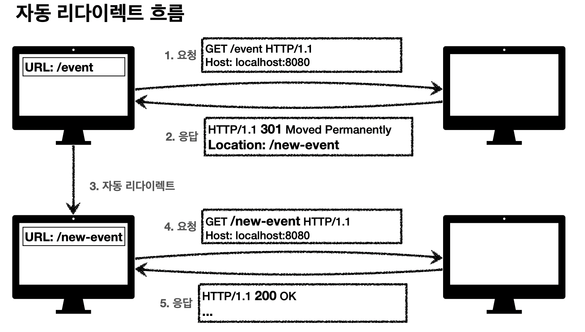

# HTTP 상태코드

## 목차

1. HTTP 상태코드 소개
2. 2xx - 성공
3. 3xx - 리다이렉션1
4. 4xx - 클라이언트 오류, 5xx - 서버 오류

------

## 1. HTTP 상태코드 소개

- 1xx (Informational): 요청이 수신되어 처리중
- 2xx (Successful): 요청 정상 처리
- 3xx (Redirection): 요청을 완료하려면 추가 행동이 필요
- 4xx (Client Error): 클라이언트 오류, 잘못된 문법등으로 서버가 요청을 수행할 수 없음
- 5xx (Server Error): 서버 오류, 서버가 정상 요청을 처리하지 못함

**모르는 상태 코드가 나타난 경우:**

- 클라이언트는 상위 상태코드로 해석해서 처리
  - 미래에 새로운 상태 코드가 추가되어도 클라이언트를 변경하지 않아도 됨
    - 299 ??? → 2xx (Successful)
    - 451 ??? → 4xx (Client Error)
    - 599 ??? → 5xx (Server Error)

**1xx는 거의 사용되지 않음:**

- 요청이 수신되어 처리중

## 2. 2xx - 성공

**주요 상태 코드:**

- 200 OK
  - 요청 성공
- 201 Created
  - 요청을 성공하여 새로운 리소스가 생성됨
- 202 Accepted
  - 요청이 접수되었으나 처리가 완료되지 않음
    - 배치 처리 같은 경우에 사용 (요청 접수 후 1시간 뒤에 배치 프로세스가 처리함)
- 204 No Content
  - 서버가 요청을 성공적으로 수행했지만, 응답 페이로드 본문에 보낼 데이터가 없음
    - save 버튼의 결과로 아무 내용이 없어도 되는 경우
    - save 버튼을 눌러도 같은 화면을 유지하는 경우
    - 결과 내용이 없어도 204 메세지만으로 성공을 인식할 수 있다.

## 3. 3xx - 리다이렉션1

> **요청을 완료하기 위해 유저 에이전트의 추가 조치 필요**

**주요 상태 코드:**

- 300 Multiple Choices
  - 거의 사용하지 않음
- 301 Moved Permanently
  - 영구 리다이렉션
- 302 Found
  - 일시 리다이렉션
- 303 See Other
  - 일시 리다이렉션
- 304 Not Modified
- 307 Temporary Redirect
  - 일시 리다이렉션
- 308 Permanent Redirect
  - 영구 리다이렉션

**리다이렉션 이해:**

- 웹 브라우저는 3xx 응답의 결과에 Location 헤더가 있으면, Location 위치로 자동 이동 (리다이렉트)

  

**리다이렉션의 종류:**

- **영구 리다이렉션**

  - 특정 리소스의 URI가 영구적으로 이동

  - 원래의 URL을 사용하지 않음, 검색 엔진 등에서도 변경 인지

    - ex) /member → /user
    - ex) /event → /new-event

  - **301 Moved Permanently**

    - 리다이렉트시 요청 메서드가 GET으로 변하고, 본문이 제거될 수 있음

    - 일반적으로 사용됨

      

  - **308 Permanent Redirect**

    - 301과 기능은 같음

    - 리다이렉트시 요청 메서드와 본문 유지 (처음 POST를 보내면 리다이렉트도 POST 유지)

      

- **일시 리다이렉션**

  - 리소스의 URI가 일시적으로 변경

  - 따라서 검색 엔진 등에서 URL을 변경하면 안됨

    - ex) 주문 완료 후 주문 내역 화면으로 이동
    - PRG 패턴: POST/Redirect/GET

  - **302 Found**

    - 리다이렉트시 요청 메서드가 GET으로 변하고, 본문이 제거될 수 있음
    - 일반적으로 사용됨

  - **303 See Other**

    - 302와 기능은 같음
    - 리다이렉트시 요청 메서드가 GET으로 변경 (본문은 유지된다.)

  - **307 Temporary Redirect**

    - 302와 기능은 같음
    - 리다이렉트시 요청 메서드와 본문 유지 (요청 메서드를 변경하면 안된다. MUST NOT)

  - **PRG 패턴**

    - PRG 사용전

      

      **위와 같은 경우 서버에서도 중복주문 방지 처리를 해야하지만 클라이언트에서도 방지가 필요함**

    - PRG 사용

      - POST로 주문후에 새로 고침으로 인한 중복 주문 방지

      - POST로 주문후에 주문 결과 화면을 GET 메서드로 리다이렉트함

      - 새로고침해도 결과 화면을 GET으로 조회하게 됨

        

  - 그래서 무엇을 사용해야 할까? 302, 303, 307

    - 잠깐 정리
      - 302 Found → GET으로 변하고, 본문이 삭제될 수 있음
      - 303 See Other → GET으로 변함
      - 307 Temporary Redirect → 메서드가 변하면 안됨
    - 역사
      - 처음 302 스펙의 의도는 HTTP 메서드를 유지하는 것
      - 그런데 웹 브라우저들이 대부분 GET으로 바꾸어버림
      - 그래서 모호한 302를 대신하는 명확한 303, 307이 등장함
    - 현실
      - 303, 307을 권장하지만 현실적으로 이미 많은 애플리케이션 라이브러리들이 302를 기본값으로 사용
      - 자동 리다이렉션시에 GET으로 변해도 되면 그냥 302를 사용해도 큰 문제 없음

- **특수 리다이렉션**

  - 결과 대신 캐시를 사용
  - 304 Not Modified
    - 캐시를 목적으로 사용
    - 클라이언트에게 리소스가 수정되지 않았음을 알려준다. 따라서 클라이언트는 로컬PC에 저장된 캐시를 재사용한다. (캐시로 리다이렉트 한다.)
    - 304 응답은 응답에 메세지 바디를 포함하면 안된다. (로컬 캐시를 사용해야 하므로)
    - 조건부 GET, HEAD 요청시 사용

## 4. 4xx - 클라이언트 오류, 5xx - 서버 오류

**4xx - 클라이언트 오류:**

- 클라이언트의 요청에 잘못된 문법등으로 서버가 요청을 수행할 수 없음
- 오류의 원인이 클라이언트에 있음
- **중요! 클라이언트가 이미 잘못된 요청을 보내고 있기 때문에, 재시도를 해도 실패함**

**4xx의 주요 상태 코드:**

- 400 Bad Request
  - 클라이언트가 잘못된 요청을 해서 서버가 요청을 처리할 수 없음
  - 요청 구문, 메세지 등등 오류
  - 클라이언트는 요청 내용을 다시 검토하고 보내야 함
  - ex) 요청 파라미터가 잘못되거나, API 스펙이 맞지 않을때
- 401 Unauthorized
  - 클라이언트가 해당 리소스에 대한 인증이 필요함
  - 인증(Authentication) 되지 않음
  - 401 오류 발생시 응답에 WWW-Authenticate 헤더와 함께 인증 방법을 설명
  - 참고
    - 인증(Authentication): 본인이 누구인지 확인, (로그인)
    - 인가(Authorization): 권한 부여 (인증은 되었으나, 해당 리소스를 조작 또는 조회할 권한)
    - 오류 메세지가 Unauthorized이지만, 인증되지 않음
- 403 Forbidden
  - 서버가 요청을 이해했지만 승인을 거부함
  - 주로 인증 자격 증명은 있지만, 접근 권한이 불충분한 경우
- 404 Not Found
  - 요청 리소스를 찾을 수 없음
  - 요청 리소스가 서버에 없거나 권한이 부족한 클라이언트가 리소스에 접근하는 경우 해당 리소스를 숨기고 싶을 때

**5xx - 서버 오류:**

- 서버 문제로 오류 발생
- 서버에 문제가 있기 때문에 재시도하면 성공할 수도 있음 (복구되거나 등등)

**5xx의 주요 상태 코드:**

- 500 Internal Server Error
  - 서버 문제로 오류 발생
  - 애매하면 500 오류
- 503 Service Unavailable
  - 서비스 이용 불가
  - 서버가 일시적인 과부하 또는 예정된 작업으로 잠시 요청을 처리할 수 없음
  - Retry-After 헤더 필드로 얼마뒤에 복귀되는지 보낼 수도 있음