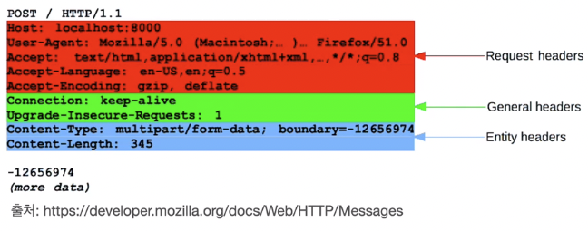
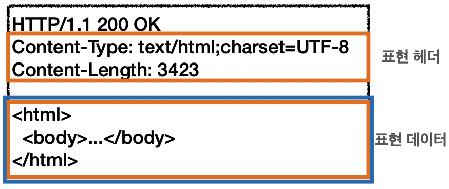
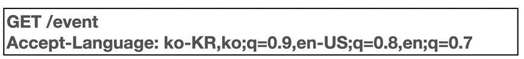
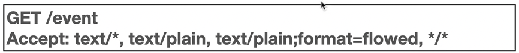
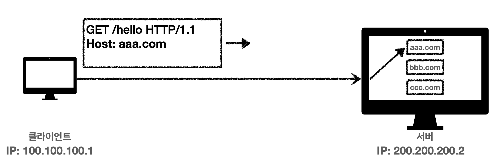
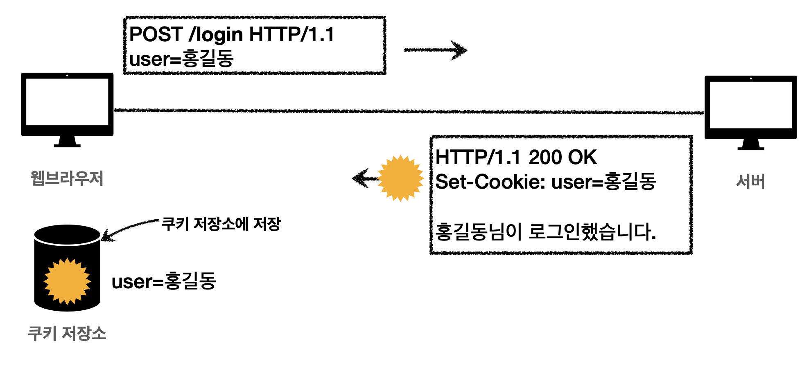
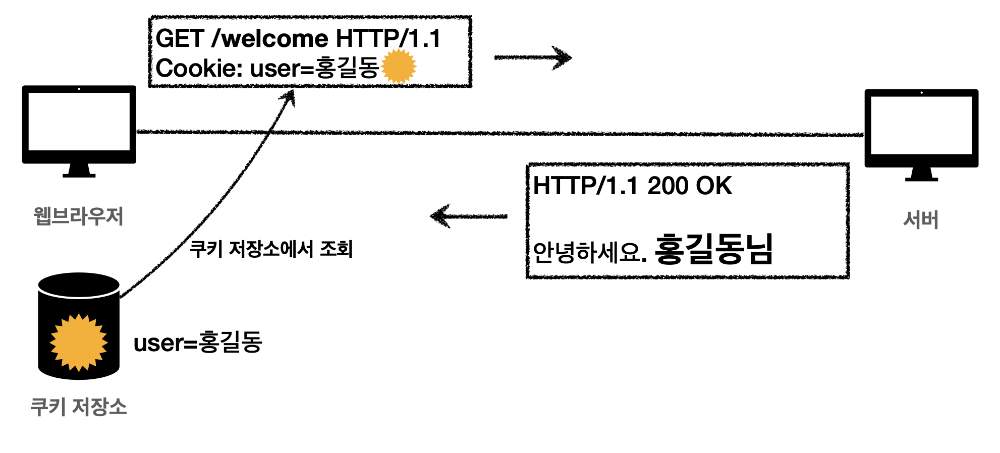

# HTTP 헤더 - 일반 헤더

## 목차

1. HTTP 헤더 개요
2. 표현
3. 콘텐츠 협상 (content negotiation)
4. 전송 방식
5. 일반 정보
6. 특별한 정보
7. 인증
8. 쿠키

------

## 1. HTTP 헤더 개요

**용도:**

- HTTP 전송에 필요한 모든 부가 정보
- ex) 메세지 바디의 내용, 메세지 바디의 크기, 압축, 인증, 요청 클라이언트, 서버 정보, 캐시 관리 정보
- 표준 헤더가 너무 많음
- 필요시 임의의 헤더 추가 가능
  - hello: world

**RFC2616 HTTP 표준 (과거):**

- 헤더

  

  - General 헤더:

     메세지 전체에 적용되는 정보

    - Connection: close

  - Request 헤더:

     요청 정보

    - User-Agent:Mozilla/5.0 (Macintosh; ..)

  - Response 헤더:

     응답 정보

    - Server: Apache

  - Entity 헤더:

     엔티티 바디 정보

    - Content-Type: text/html, Content-Length: 3423

- 본문

  - 메세지 본문은 엔티티 본문을 전달하는데 사용
  - 엔티티 본문은 요청이나 응답에서 전달할 실제 데이터
  - 엔티티 헤더는 엔티티 본문의 데이터를 해석할 수 있는 정보 제공
    - 데이터 유형(html, json), 데이터 길이, 압축 정보 등등

**RFC7230 ~ 7235 HTTP 표준:**

- 변화

  - 엔티티(Entity) → 표현(Representation)
  - Representation = Representation Metadata + Representation Data

- 본문

  

  - 메세지 본문을 통해 표현 데이터 전달
  - 메세지 본문 = 페이로드
  - 표현은 요청이나 응답에서 전달할 실제 데이터
  - 표현 헤더는 표현 데이터를 해석할 수 있는 정보 제공
    - 데이터 유형(html, json), 데이터 길이, 압축 정보 등등
  - 참고
    - 표현 헤더는 표현 메타데이터와 페이로드 메세지를 구분해야 하지만, 여기서는 생략한다.

## 2. 표현

- Content-Type: 표현 데이터의 형식
  - 미디어 타입, 문자 인코딩
  - ex)
    - text/thml; charset=utf-8
    - application/json
    - image/png
- Content-Encoding: 표현 데이터의 압축 방식
  - 표현 데이터를 압축하기 위해 사용
  - 데이터를 전달하는 곳에서 압축 후 인코딩 헤더 추가
  - 데이터를 읽는 쪽에서 인코딩 헤더의 정보로 압축 해제
  - ex)
    - gzip
    - deflate
    - identity (압축 안함)
- Content-Language: 표현 데이터의 자연 언어
  - ex)
    - ko
    - en
    - en-US
- Content-Length: 표현 데이터의 길이
  - 바이트 단위
  - Transfer-Encoding(전송 코딩)을 사용하면 Content-Length를 사용하면 안됨
- 표현 헤더는 전송, 응답 모두 사용

## 3. 콘텐트 협상 (content negotiation)

- 클라이언트가 선호하는 표현 요청이다.
- 요청시에만 사용한다.
- Quality Values(q)에 의해서 협상이 동작한다.
- Accept: 클라이언트가 선호하는 미디어 타입 전달
- Accept-Charset: 클라이언트가 선호하는 문자 인코딩
- Accept-Encoding: 클라이언트가 선호하는 문자 인코딩
- Accept-Language: 클라이언트가 선호하는 자연 언어

**Quality Values(q):**

- 0 ~ 1, 클수록 높은 우선 순위

- 생략되면 1

- Accept-Language: ko-KR,ko;q=0.9,en-US;q=0.8,en;q=0.7

  

  1. ko-KR;q=1 (q생략)
  2. ko;q=0.9
  3. en-US;q=0.8
  4. en;q=0.7

- 구체적인 것이 우선된다.

- Accept: text/*, text/plain, text/plain;format=flowed, **/**

  

  1. text/plain;format=flowed
  2. text/plain
  3. text/*
  4. */*

## 4. 전송 방식

- 단순 전송
  - Content-Length를 사용
- 압축 전송
  - Content-Encoding을 사용
- 분할 전송
  - Transfer-Encoding
  - Content-Length를 예상할 수 없다.
- 범위 전송
  - Content-Range

## 5. 일반 정보

- From: 유저 에이전트의 이메일 정보
  - 일반적으로 잘 사용되지 않음
  - 검색 엔진 같은 곳에서 주로 사용
  - 요청에서 사용
- Referer: 이전 웹 페이지 주소
  - 현재 요청된 페이지의 이전 웹 페이지 주소
  - A → B로 이동하는 경우 B를 요청할 때 Referer: A를 포함해서 요청 (쉽게 말해서 이전 싸이트 위치)
  - Referer를 사용해서 유입 경로 분석 가능
  - 요청에서 사용
  - 참고
    - referer는 단어 referrer의 오타
- User-Agent: 유저 에이전트 애플리케이션 정보
  - 클라이언트의 애플리케이션 정보 (웹 브라우저 정보 등)
  - 통계 정보
  - 어떤 종류의 브라우저에서 장애가 발생하는지 파악 가능
  - 요청에서 사용
- Server: 요청을 처리하는 오리진 서버의 소프트웨어 정보
  - 실제 응답을 만들어주는 서버에 대한 정보  (캐시 서버는 아님)
  - Server: Apache/2.2.22 (Debian)
  - server: nginx
  - 응답에서 사용
- Date: 메세지가 생성된 날짜
  - 응답에서 사용

## 6. 특별한 정보

- Host: 요청한 호스트 정보 (도메인)

  

  - 요청에서 사용
  - 필수로 사용
  - 하나의 서버가 여러 도메인을 처리해야 할때
  - 하나의 IP 주소에 여러 도메인이 적용되어 있을 때

- Location: 페이지 리다이렉션

  - 웹 브라우저는 3xx 응답 결과에 Location 헤더가 있으면, Location 위치로 자동 리다이렉트
  - 201 Created 에서는 요청에 의해 생성된 리소스 URI

- Allow: 허용 가능한 HTTP 메서드

  - 405 Method Not Allowed 에서 응답에 포함해야함
  - Allow: GET, HEAD, PUT

- Retry-After: 유저 에이전트가 다음 요청을 하기까지 기다려야 하는 시간

  - 503 Service Unavailable: 서비스가 언제까지 불능인지 알려줄 수 있음
  - Retry-After: Fri, 31 Dec 1999 23:59:59 GMT (날짜 표기)
  - Retry-After: 120 (초단위 표기)

## 7. 인증

- Authorization: 클라이언트 인증 정보를 서버에 전달
  - Authorization: Basic xxxx
- WWW-Authenticate: 리소스 접근시 필요한 인증 방법 정의
  - 401 Unauthorized 응답과 함께 사용
  - WWW-Authenticate: Newauth realm=”apps”, type=1, titl1=”Login to \”apps\””, Basic realm=”simple”

## 8. 쿠키

- Set-Cookie: 서버에서 클라이언트로 쿠키 전달 (응답)

  

  **set-cookie의 예)** **set-cookie: sessionId=abcde1234; expires=Sat, 26-Dec-2020 00:00:00 GMT; path=/; [domain=.google.com](http://domain=.google.com); secure**

- Cookie: 클라이언트가 서버에서 받은 쿠키를 저장하고, HTTP 요청시 서버로 전달

  

- 사용처

  - 사용자 로그인 세션 관리
  - 광고 정보 트래킹

- 쿠키 정보는 항상 서버에 전송됨

  - 네트워크 트래픽 추가 유발
  - 최소한의 정보만 사용 (세션 id, 인증 토큰)
  - 서버에 전송하지 않고, 웹 브라우저 내부에 데이터를 저장하고 싶으면 웹 스토리지 (localStorage, sessionStorage) 참고

- 주의! 보안에 민감한 데이터는 저장하면 안됨 (주민번호, 신용카드 번호 등)

**생명주기:**

- set-cookie: 

  expires=Sat, 26-Dec-2020 00:00:00 GMT

  - 만료일이 되면 쿠키 삭제

- set-cookie: 

  max-age=3600

   (second)

  - 0이나 음수를 지정하면 쿠키 삭제

- 세션 쿠키: 만료 날짜를 생략하면 브라우저 종료시까지만 유지

- 영속 쿠키: 만료 날짜를 입력하면 해당 날짜까지 유지

**도메인:**

- [domain=example.org](http://domain=example.org)
- 명시: 명시한 문서 기준 도메인 + 서브 도메인 포함
  - domain=example.org를 지정해서 쿠키 생성
    - example.org는 물론이고, dev.example.org도 쿠키 접근
- 생략: 현재 문서 기준 도메인만 적용
  - example.org에서 쿠키를 생성하고 domain 지정을 생략
    - exmaple.org에서만 쿠키 접근
    - dev.example.org는 쿠키 미접근

**경로:**

- path=/home
- **이 경로를 포함한 하위 경로 페이지만 쿠키 접근**
- **일반적으로 path=/ 루트로 지정**
- ex)
  - path=/home 지정
  - /home → 가능
  - /home/level1 → 가능
  - /home/level1/level2 → 가능
  - /hello → 불가능

**보안:**

- Secure
  - 쿠키는 http, https를 구분하지 않고 전송
  - Secure를 적용하면 https인 경우에만 전송
- HttpOnly
  - XSS(Cross-Site Scripting) 공격 방지
  - JS에서 접근 불가
  - HTTP 전송에만 사용
- SameSite
  - XSRF(Cross-Site Request Forery, CSRF) 공격 방지
  - 요청 도메인과 쿠키에 설정된 도메인이 같은 경우에만 쿠키 전송