# HTTP 헤더 - 캐시와 조건부 요청

## 목차

1. 캐시 기본 동작
2. 검증 헤더와 조건부 요청1
3. 검증 헤더와 조건부 요청2
4. 캐시와 조건부 요청 헤더
5. 프록시 캐시
6. 캐시 무효화

------

## 1. 캐시 기본 동작

**캐시가 없을 때:**

- 데이터가 변경되지 않아도 계속 네트워크를 통해서 데이터를 다운로드 받아야 한다.
- 인터넷 네트워크는 매우 느리고 비싸다.
- 브라우저 로딩 속도가 느리다.
- 느린 사용자 경험

**캐시 적용:**

- 캐시 덕분에 캐시 가능 시간동안 네트워크를 사용하지 않아도 된다.
- 비싼 네트워크 사용량을 줄일 수 있다.
- 브라우저 로딩 속도가 매우 빠르다.
- 빠른 사용자 경험

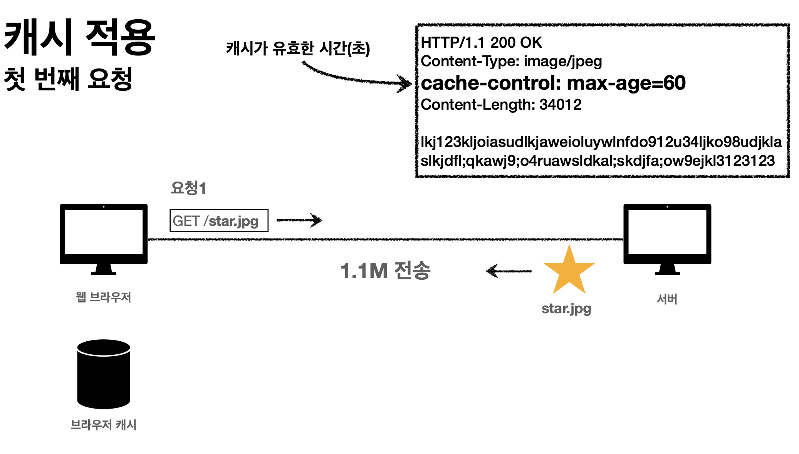

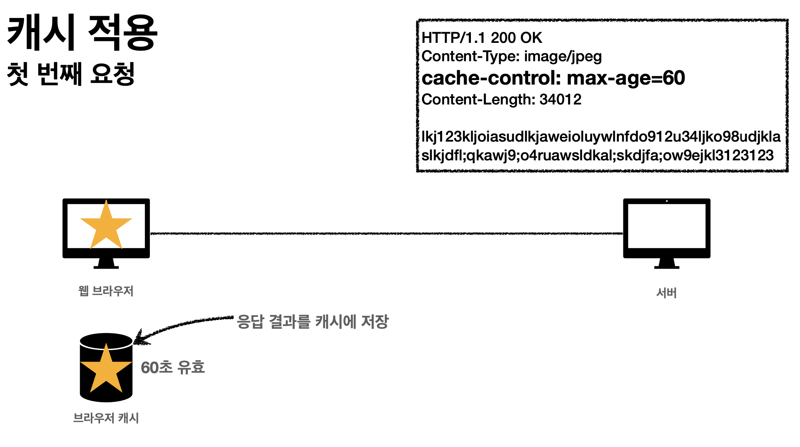

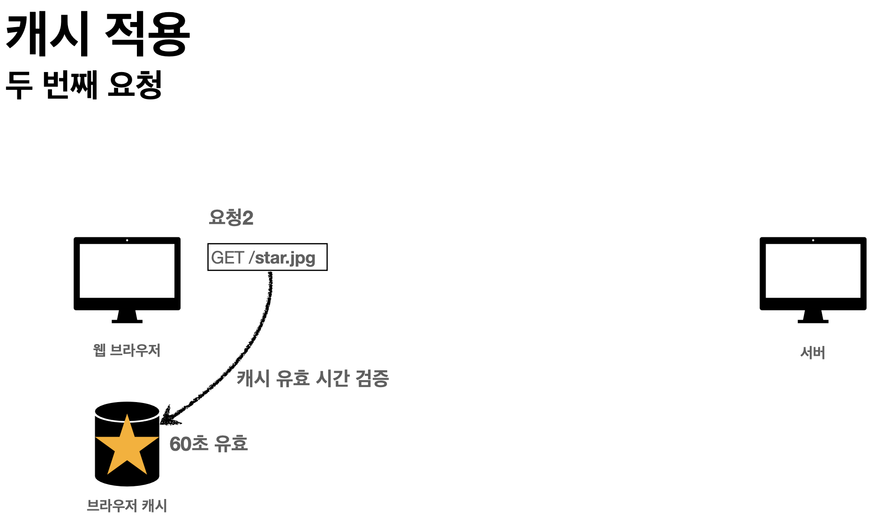

**캐시 시간 초과:**

- 캐시 유효시간이 초과하면 서버를 통해 데이터를 다시 조회하고, 캐시를 갱신한다.
- 이때 다시 네트워크 다운로드가 발생한다.

## 2. 검증 헤더와 조건부 요청1

- 캐시 유효시간이 초과해서 서버에 다시 요청하면 두 가지 상황이 나타난다.
  1. 서버에서 기존 데이터를 변경함
  2. 서버에서 기존 데이터를 변경하지 않음
     - 데이터를 전송하는 대신에 저장해 두었던 캐시를 재사용 할 수 있다.
     - 클라이언트의 데이터와 서버의 데이터가 같다는 사실을 확인할 방법이 필요 → 검증 헤더 추가

**검증 헤더 추가:**

- 헤더에 Last-Modified 추가

- 브라우저 캐시에서 Last-Modified 추가

- 요청시 if-modified-since: 추가

  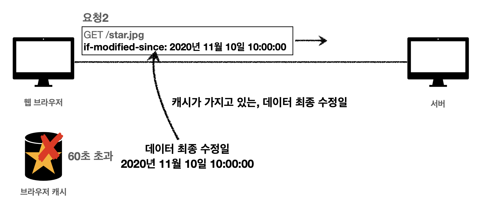

- 데이터가 수정되지 않은 경우 304 Not Modified 응답

  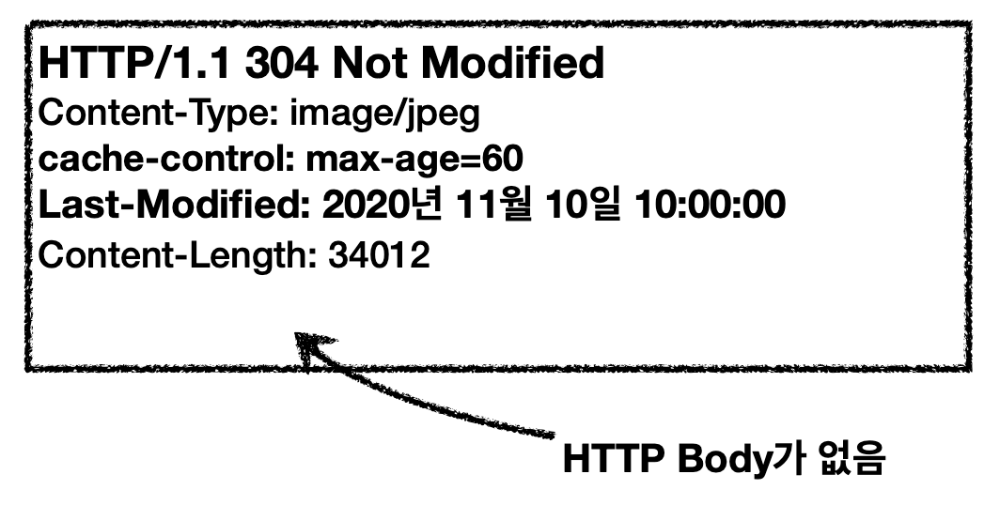

**정리:**

- 캐시 유효시간이 초과해도, 서버의 데이터가 갱신되지 않으면 304 Not Modified + 헤더 메타 정보만 응답 (body x)
- 클라이언트는 서버가 보낸 응답 헤더 정보로 캐시의 메타 정보를 갱신
- 클라이언트는 캐시에 저장되어 있는 데이터 재활용
- 결과적으로 네트워크 다운로드가 발생하지만 용량이 적은 헤더 정보만 다운로드

## 3. 검증 헤더와 조건부 요청2

- 검증 헤더
  - 캐시 데이터와 서버 데이터가 같은지 검증하는 데이터
  - Last-Modified, ETag
- 조건부 요청 헤더
  - 검증 헤더로 조건에 따른 분기
  - If-Modified-Since: Last-Modified 사용
  - If-None-Match: ETag 사용
  - 조건이 만족하면 200 OK
  - 조건이 만족하지 않으면 304 Not Modified
- Last-Modified, If-Modified-Sine의 단점
  - 1초 미안 단위로 캐시 조정이 불가능
  - 날짜 기반의 로직 사용
  - 데이터를 수정해서 날짜가 다르지만, 같은 데이터를 수정해서 데이터 결과가 똑같은 경우
  - 서버에서 별도의 캐시 로직을 관리하고 싶은 경우
    - ex) 스페이스나 주석처럼 크게 영향이 없는 변경에서 캐시를 유지하고 싶은 경우

**ETag, If-None-Match:**

- ETag (Entity Tag)
- 캐시용 데이터에 임의의 고유한 버전 이름을 달아둠
  - ex) ETag: “v1.0”, ETag: “a2jiodwjekjl3”
- 데이터가 변경되면 이 이름을 바꾸어서 변경함 (Hash를 다시 생성)
  - ex) ETag: “aaaaa” → ETag: “bbbbb”
- ETag만 보내서 같으면 유지, 다르면 다시 받음

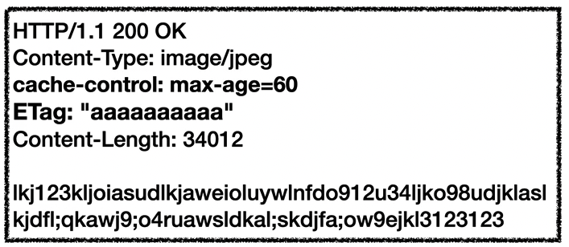

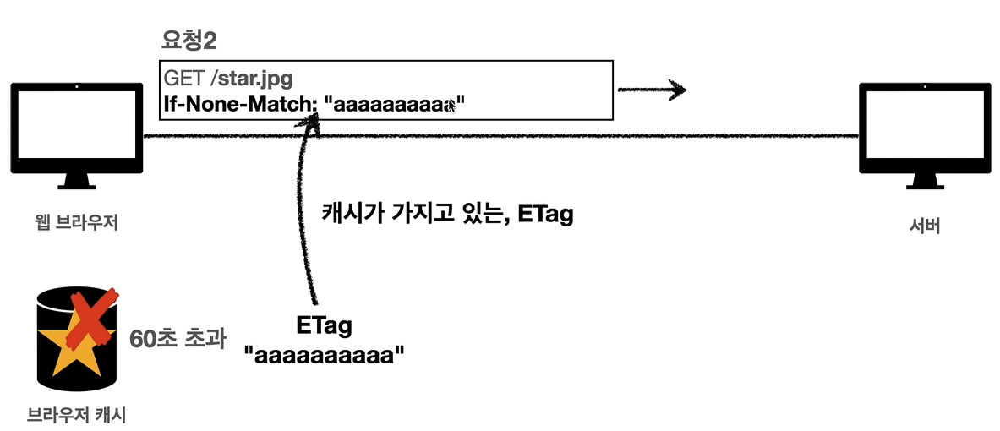

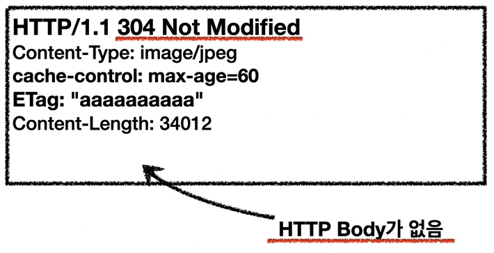

**정리:**

- ETag만 서버에 보내서 같으면 유지, 다르면 다시 받음
- 캐시 제어 로직을 서버에서 완전히 관리
- 클라이언트는 단순히 이 값을 서버에 제공 (클라이언트는 캐시 메커니즘을 모름)
- ex)
  - 서버는 베타 오픈 기간인 3일 동안 파일이 변경되어도 ETag를 동일하게 유지
  - 애플리케이션 배포 주기에 맞추어 ETag 모두 갱신

## 4. 캐시와 조건부 요청 헤더

캐시 제어 헤더:

- Cache-Control: 캐시 제어
  - 최근에는 이 헤더로 모두 제어 가능
  - 캐시 지시어 (directives)
  - Cache-Control: max-age
    - 캐시 유효 시간, 초 단위
  - Cache-Control: no-cache
    - 데이터는 캐시해도 되지만, 항상 오리진 서버에 검증하고 사용
  - Cache-Control: no-store
    - 데이터에 민감한 정보가 있으므로 저장하면 안됨
    - 메모리에서 사용하고 최대한 빨리 삭제
- Pragma: (하위 호환)
  - Pragma: no-cache
  - HTTP/1.0 하위 호환
- Expires: 캐시 유효 기간 (하위 호환)
  - Expires: Mon, 01 Jan 1990 00:00:00 GMT
  - 캐시 만료일을 정확한 날짜로 지정
  - HTTP/1.0 부터 사용
  - 지금은 더 유연한 Cache-Control: max-age 권장
  - Cache-Control: max-age와 함께 사용하면 Expires는 무시됨

## 5. 프록시 캐시

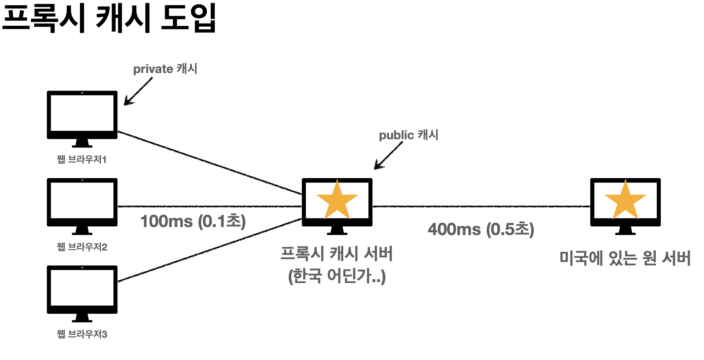

**Cache-Control 캐시 지시어 (기타):**

- 캐시 지시어 (directives)
- Cache-Control: public
  - 응답이 public 캐시에 저장되어도 됨
- Cache-Control: private
  - 응답이 해당 사용자만을 위한 것임, private 캐시에 저장해야 함 (기본 값)
- Cache-Control: s-maxage
  - 프록시 캐시에만 적용되는 max-age
- Age: 60 (HTTP 헤더)
  - 오리진 서버에서 응답 후 프록시 캐시 내에 머문 시간 (초)

## 6. 캐시 무효화

**Cache-Control 확실한 캐시 무효화 응답:**

- Cache-Control: no-cache, no-store, must-revalidate
  - Cache-Control: no-cache
    - 데이터는 캐시해도 되지만, 항상 오리진 서버에 검증하고 사용
  - Cache-Control: no-store
    - 데이터에 민감한 정보가 있으므로 저장하면 안됨
    - 메모리에서 사용하고 최대한 빨리 삭제
  - Cache-Control: must-revalidate
    - 캐시 만료 후 최초 조회시 원 서버에 검증해야함
    - 원 서버 접근 실패시 반드시 오류가 발생해야 함 - 504 Gateway Timeout
    - must-revalidate는 캐시 유효 시간이라면 캐시를 사용함
- Pragma: no-cache
  - HTTP/1.0 하위 호환

**no-cache vs must-revalidate:**

- no-cache

  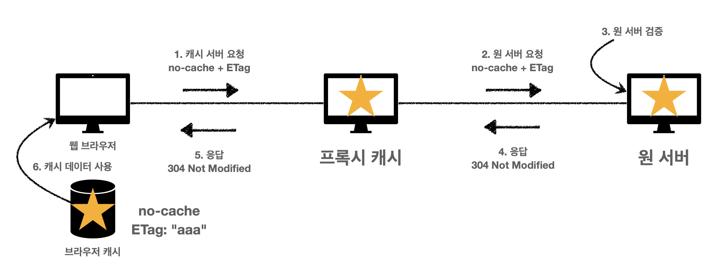

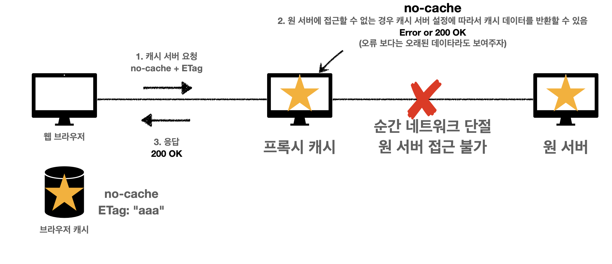

- must-revalidate

  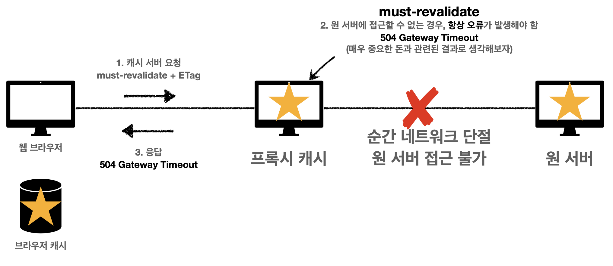

  - 순간적으로 오리진 서버 접근이 불가능한 경우 must-revalidate는 항상 504 Gateway Timeout이 발생한다.
